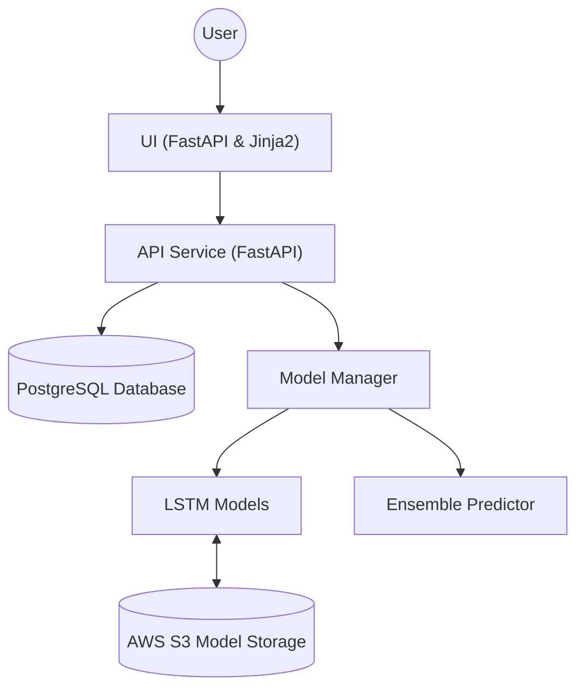

# QuantumVestAI Architecture

The diagram below illustrates the major components of the application and how they interact. It shows the flow from the user interface through the API to the database and machine learning models.

The UI uses FastAPI and Jinja2 templates to render pages. The API service exposes REST endpoints for authentication, portfolio management, and prediction requests. Machine learning models (primarily LSTM-based) are managed by the `ModelManager` class, which can load models from local storage or AWS S3 and is capable of combining them using an ensemble predictor. The API persists data in a PostgreSQL database.

An optional `ChatGPTService` allows the UI to send questions to OpenAI's ChatGPT API. When enabled, this service provides conversational explanations about predictions and market trends directly in the interface.
